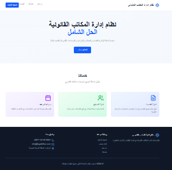

# 🏛️ Legal Office System

نظام ويب متكامل لإدارة مكاتب المحاماة يشمل:
- تسجيل المحامين (شهري / سنوي)
- لوحة تحكم المحامي (قضايا، عملاء، فواتير...)
- مساعد ذكي (GPT) لتحليل القضايا
- لوحة مسؤول لإدارة النظام
- يدعم 3 لغات: العربية، التركية، الإنجليزية

## ⚙️ التقنيات المستخدمة
- Frontend: React.js + TailwindCSS
- Backend: Django + DRF
- Database: MySQL
- AI: OpenAI GPT-4 + LangChain
- Hosting: Vercel + Render
- التخزين: Cloudinary / S3

## 📦 التثبيت المحلي
```bash
# Frontend
cd frontend
npm install
npm run dev

# Backend
cd backend
pip install -r requirements.txt
python manage.py runserver

---

### ✅ **الخطوة 5: إضافة `.gitignore`**
لمنع رفع ملفات غير ضرورية، أنشئ ملف `.gitignore` يحتوي:



```gitignore
# Python
__pycache__/
*.pyc
env/
*.env

# Node
node_modules/
dist/

# OS
.DS_Store
Thumbs.db
